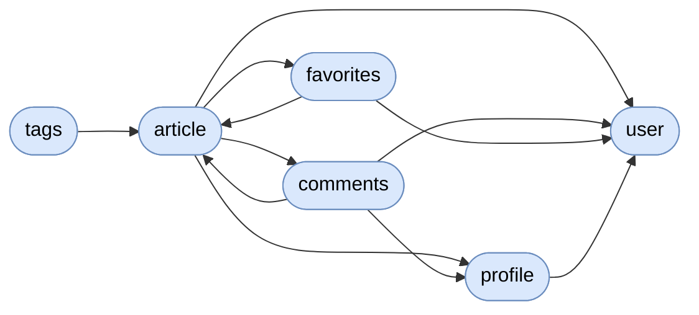

# Conduit

[](https://github.com/dearrudam/sdd4j-realworld-api/actions/workflows/hurl-conformance.yml)

<!-- sdd4j:generated:start — projection of the specs; do not edit; `apply` regenerates from the system doc + per-capability package docs -->
> A spec-driven implementation of the RealWorld Conduit API on Quarkus.

**Vision:** Demonstrate SDD4J — capability specs as contracts, EARS requirements traced to tests — on a real-world-shaped API.

## Capabilities
- **user** — manage user accounts: registration, authentication, current-user retrieval, and profile updates · [`spec`](src/main/java/org/acme/user/package-info.java)
- **profile** — present a user's public representation and manage the follow relationships between users · [`spec`](src/main/java/org/acme/profile/package-info.java)
- **article** — publish, list, read, update, and delete articles — including tag, author, and favorited-by filtering and a personal feed · [`spec`](src/main/java/org/acme/article/package-info.java)
- **favorites** — record and remove users' favorite marks on articles, returning the affected article's representation · [`spec`](src/main/java/org/acme/favorites/package-info.java)
- **comments** — list, create, and delete comments on articles — remarks authored by identified users, ordered oldest first · [`spec`](src/main/java/org/acme/comments/package-info.java)
- **tags** — report the distinct set of tags carried by existing articles, alphabetically ordered · [`spec`](src/main/java/org/acme/tags/package-info.java)

## Components
<!-- projection of the system doc's ## Components wiring; nodes = capabilities, edges = declared calls/events; never inferred from code -->

<!-- sdd4j:generated:end -->

## API

Wire contract: [`src/main/openapi/openapi.yml`](src/main/openapi/openapi.yml) (RealWorld Conduit API v2.0.0). Base path `/api`; protected endpoints take `Authorization: Token <jwt>`; errors use `{"errors":{"field":["message"]}}`. Conformance: the upstream RealWorld Hurl suite (`specs/api/hurl` in `realworld-apps/realworld`, `HOST=http://localhost:8080 ./run-api-tests-hurl.sh`) passes 13/13 files, 154/154 requests, and runs on non-draft PRs via `.github/workflows/hurl-conformance.yml`.

| Method | Path | Operation |
| --- | --- | --- |
| `POST` | `/api/users` | Register a user |
| `POST` | `/api/users/login` | Authenticate (login) |
| `GET` | `/api/user` | Current user |
| `PUT` | `/api/user` | Update current user |
| `GET` | `/api/profiles/{username}` | Get a profile (auth optional) |
| `POST` | `/api/profiles/{username}/follow` | Follow a user |
| `DELETE` | `/api/profiles/{username}/follow` | Unfollow a user |
| `GET` | `/api/articles` | List articles (tag/author/favorited filters, pagination) |
| `GET` | `/api/articles/feed` | Articles by followed users |
| `POST` | `/api/articles` | Create an article |
| `GET` | `/api/articles/{slug}` | Get an article (auth optional) |
| `PUT` | `/api/articles/{slug}` | Update an article (author only) |
| `DELETE` | `/api/articles/{slug}` | Delete an article (author only) |
| `POST` | `/api/articles/{slug}/favorite` | Favorite an article |
| `DELETE` | `/api/articles/{slug}/favorite` | Unfavorite an article |
| `GET` | `/api/articles/{slug}/comments` | List an article's comments (auth optional) |
| `POST` | `/api/articles/{slug}/comments` | Comment on an article |
| `DELETE` | `/api/articles/{slug}/comments/{id}` | Delete a comment (comment or article author) |
| `GET` | `/api/tags` | List tags |

## Running the application in dev mode

You can run your application in dev mode that enables live coding using:

```shell script
./mvnw quarkus:dev
```

> **_NOTE:_**  Quarkus now ships with a Dev UI, which is available in dev mode only at <http://localhost:8080/q/dev/>.

## Packaging and running the application

The application can be packaged using:

```shell script
./mvnw package
```

It produces the `quarkus-run.jar` file in the `target/quarkus-app/` directory.
Be aware that it’s not an _über-jar_ as the dependencies are copied into the `target/quarkus-app/lib/` directory.

The application is now runnable using `java -jar target/quarkus-app/quarkus-run.jar`.

If you want to build an _über-jar_, execute the following command:

```shell script
./mvnw package -Dquarkus.package.jar.type=uber-jar
```

You can then execute your native executable using: `./target/sdd4j-realworld-api-1.0.0-SNAPSHOT-runner`

## Creating a native executable

You can create a native executable using:

```shell script
./mvnw package -Dnative
```

Or, if you don't have GraalVM installed, you can run the native executable build in a container using:

```shell script
./mvnw package -Dnative -Dquarkus.native.container-build=true
```

You can then execute your native executable with: `./target/sdd4j-realworld-api-1.0.0-SNAPSHOT-runner`

If you want to learn more about building native executables, please consult <https://quarkus.io/guides/maven-tooling>.

## Related Guides

- SmallRye Health ([guide](https://quarkus.io/guides/smallrye-health)): Monitor service health
- REST JSON-B ([guide](https://quarkus.io/guides/rest#json-serialisation)): JSON-B serialization support for Quarkus REST. This extension is not compatible with the quarkus-resteasy extension, or any of the extensions that depend on it.
